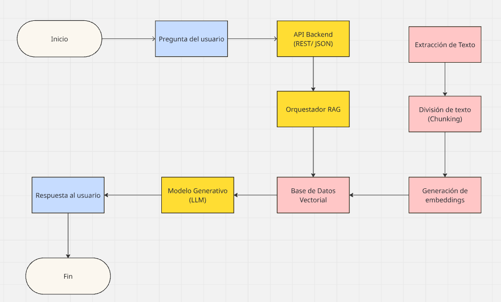

# Arquitectura - Asistente Conversacional IA

---

## Diagrama simple de flujo 

## Elección del modelo de embeddings

El asistente utiliza un modelo de embeddings para:

- Indexar el PDF seleccionado.
- Realizar búsqueda semántica a partir del mensaje del usuario.
- Recuperar los fragmentos más relevantes (top-k) para construir el contexto del LLM.

Para este asistente se utiliza: **"all-MiniLM-L6-v2" de Sentence Transformers (HuggingFace)**

## Elección del modelo generativo 

El modelo generativo (LLM) se usa para:

- Entender la intención del usuario.
- Combinar el contexto recuperado (RAG) con el mensaje del usuario.
- Producir respuestas naturales, en español, y eventualmente estructuradas.

Para este asistente se utiliza: **Ollama("llama3.2:1b")**

## Escalación en producción

Se utiliza blueprint para en caso de escalar el proyecto los cambios sean más sencillos de realizar.

## Limitaciones del enfoque

- **Dependencia del contexto cargado (RAG):** Si los documentos no se cargan o actualizan correctamente, el modelo puede dar respuestas desactualizadas o incompletas.

- **Alucinaciones:**
    - Aunque se use RAG, el LLM puede inventar información si el contexto es insuficiente o ambiguo.
    - Mitigación: prompts que obliguen al modelo a decir “no hay información suficiente” cuando la evidencia no sea suficiente.

## Uso de memoria conversacional

La memoria conversacional permite que el asistente mantenga contexto entre mensajes de un mismo usuario. Para ello dependiendo se utilizaria guardar las N preguntas y respuestas anteriores o guardar un resumen de la conversación en una base de datos.

## Integración con otros canales

Para Web se integraria mediante la creacion de un Frontend(HTML/React/etc...) el cual se comunicaria con la API creada.

## Logs, Metricas y moniteo

Los logs se pueden guardar localmente o utlizar una base de datos para verificar el correcto funcionamiento y en caso de que falle revisar donde se generó el error exactamente. En cuanto a las métricas se con ayuda del usuario calificar la respuesta esperada si es correcta o incorrecta (like o dislike).